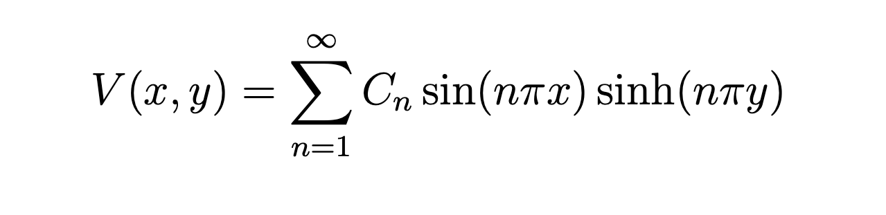

# ElectricPotentialProject

## Description
This project solves the **Laplace equation** to simulate the electric potential and electric field inside a 2D square hollow tube. The solution is found using a **Fourier sine series** approach. The solution will also be compared with known analytical results, to analyze accuracy of the solution relative to the number of Fourier terms used in the calculations. The goal is to provide a clean and reproducible simulation for electric potential and electric field modelling.

## Theory
The **Laplace equation** is a second-order partial differential equation used to describe electrostatic systems with no free charge. In this project we solve the dimensionless form of the Laplace equation:

where $V(x,y)$ is the electric potential, and $x$ and $y$ are the spatial coordinates. The Laplace equation states that the second partial derivatives of the potential with respect to both coordinates must sum to zero.

In this project the system is a square region where the potential is fixed to zero along three edges and defined by a function $V_0(x)$ along the top edge. The boundary conditions are:

And the potential along the top edge is defined by a function $V_0(x)$, which can be chosen from a set of predefined functions in the `potentials.py` file. For example, one can use a constant potential, a linear potential, or a sinusoidal potential.

The solution to the equation is derived using seperation of variables, assuming assuming that the solution takes the form $V(x,y) = X(x)Y(y)$. The general solution satifying the boundary conditions is:

To determine the Fourier coefficent $C_n$, we can apply **Fourier's trick** to isolate each term in the sum, giving the expression:

By combining the Fourier series for $V(x,y)$ and the expression for $C_n$, we can approximate the electric potential in the region by using a finite number of Fourier terms $N$. Since we know the analytical potential at the border, we can compare the numerical solution with the analytical one to analyze the convergence of the numerical solution toward the analytical one as $N$ increases. This is explored in the `analysis.py` file.

The electric field can then be calculated as the negative gradient of the potential:

## Example
Here is an example of how the electric potential looks like for a sinusoidal potential with a frequency of 2π along the top edge, using 10 Fourier terms and a grid resolution of 100:

## How to run the project
This is how you run the project:
1. Make sure you have the required Python packages installed:  **`numpy`, `matplotlib`, `scipy`, and `pytest`**.
2. Run the `main.py` file.

You can choose to run a **simulation**, or **analysis**. Both have default parameters, but you can also set your own parameters using command-line arguments.

### Simulation
The simulation will calculate the electric potential and electric field for a given boundary condition function $V_0(x)$
- You will asked to provide the potential function you want to use. The available options are: `zero`, `constant`, `sin`, `step`, and `gaussian`. You can also set the number of Fourier terms $N$ and the grid resolution. 
- If you do not provide any input, the default values will be used: `constant` potential function, `N=10`, and `resolution=100`.

### Analysis
The analysis compares the numerical solution with the analytical one, and shows how the accuracy improves as the number of Fourier terms increases.
- You will be asked to provide the potential function you want to use. The available options are: `zero`, `constant`, `sin`, `step`, and `gaussian`. 
- You can also set the minimum and maximum number of Fourier terms $N_{min}$ and $N_{max}$, the number of points to calculate in this range $N_{num}$, and the grid resolution.
- If you do not provide any input, the default values will be used: `step` potential function, `N_min=1`, `N_max=50`, `N_num=10`, and `resolution=100`.

## Structure
The project consists of the following Python files:
- `main.py`: Starts the program using an interactive command-line interface (CLI), allowing the user to choose whether to run a simulation or an analysis. The user can also set parameters such as grid resolution and which boundary condition function to use.
- `solver.py`: Solves the 2D Laplace equation using a Fourier series to calculate the electric potential. It also calculates the electric field by taking the gradient of the potential.
- `potentials.py`: Containes different boundrary condition functions $V_0(x)$ used in the simation.
- `simulation.py`: Runs the simulation of the electric potential and the electric field. Using functions from `solver.py` and the selected parameters.
- `analysis.py`: Analyzes the convergence of the numerical solution toward the analytical one, relative to the number of Fourier terms used.
- `plotting.py`: Generates various plots for electric potential and electric field tests. Along with plots for analysis of convergence and potential profiles for different N values.
- `testing.py`: Contains tests to check that the code works correctly.

## References

Based on:
D. J. Griffiths, *Introduction to  Electrodynamics* (5th ed.), Cambridge University Press, 2020 - see Example 3.3.
Publisher link: [Cambridge University Press](https://www.cambridge.org/highereducation/books/introduction-to-electrodynamics/FD23E188E2BDCDB40199CFE3386EC08F#overview)
